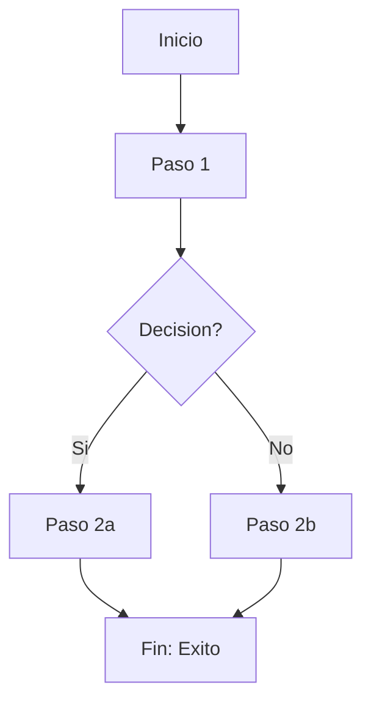
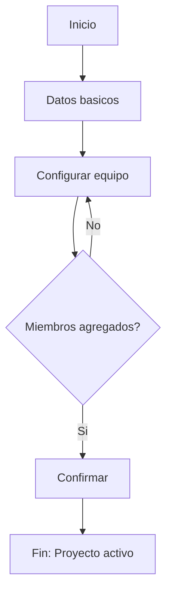

---
paths:
  - specs/03-experience/**/FLOW-*.md
  - specs/domains/*/03-experience/**/FLOW-*.md
---

# Flujos UI KDD

> Aplica cuando trabajas en `specs/03-experience/**/FLOW-*.md`

## Nombrado de Archivo

Patron: `FLOW-NombreDelFlujo.md`

Ejemplos:
- `FLOW-Onboarding.md`
- `FLOW-CreateProject.md`
- `FLOW-ConfigureTeam.md`

## Frontmatter Requerido

```yaml
---
kind: ui-flow
status: draft
version: "1.0"
links:
  entities: []              # Entidades involucradas
  use-cases: []             # Use cases implementados
  views: []                 # Vistas que componen el flujo
storybook:
  category: "Flows"
  auto-generate: true
---
```

## Estructura del Documento

### Secciones Obligatorias

```markdown
# Flow: NombreDelFlujo

## Description
Proceso completo que representa. Que objetivo logra el usuario?

## Primary Actor
- **User**: Tipo de usuario
- **Preconditions**: Estado requerido antes de iniciar

## Flow Diagram


## Flow Steps
### Step 1: NombrePaso
### Step 2: NombrePaso
...

## Terminal States
### Success
### Cancelled
### Error
```

## Flow Steps: Formato

```markdown
### Step 1: Ingresar Datos

| Attribute | Value |
|-----------|-------|
| **View** | [[VIEW-NewProject]] |
| **User Action** | Completa formulario con titulo y descripcion |
| **System Response** | Valida datos en tiempo real |
| **Next Step** | Step 2 / Error |

#### Step Wireframe

```ascii
+--------------------------------------+
|        Step 1: Datos basicos         |
+--------------------------------------+
|                                       |
|   Titulo: [_________________________] |
|   Descripcion: [____________________] |
|                                       |
|   [Cancelar]           [Continuar ->] |
+--------------------------------------+
```
```

## Decision Points

```markdown
## Decision Points

### Decision 1: Tiene miembros configurados?

```ascii
        +-----------------+
        |  miembros > 0?  |
        +--------+--------+
                 |
        +--------+--------+
        v                 v
   [Continuar]       [Configurar]
```

- **If met**: Continua a Step 3
- **If not met**: Redirige a configuracion de equipo
```

## Terminal States: Formato

```markdown
## Terminal States

### Success

| Attribute | Value |
|-----------|-------|
| **Condition** | Usuario completo todos los pasos |
| **Final State** | [[Proyecto]] creado con status `activo` |
| **Redirect** | [[VIEW-ProjectDetail]] |
| **Feedback** | Toast "Proyecto creado exitosamente" |

```ascii
+--------------------------------------+
|          Check Completado            |
+--------------------------------------+
|                                       |
|   Tu Proyecto ha sido creado.        |
|                                       |
|          [Ver Proyecto]              |
|          [Crear otro]                |
+--------------------------------------+
```

### Cancelled

| Attribute | Value |
|-----------|-------|
| **Condition** | Usuario cancela en cualquier paso |
| **Final State** | Sin cambios / Borrador guardado |
| **Redirect** | Dashboard |
| **Feedback** | Confirmar si hay cambios sin guardar |

### Error

| Attribute | Value |
|-----------|-------|
| **Condition** | Error del sistema |
| **Behavior** | Mostrar error, ofrecer retry |
| **Feedback** | Toast con mensaje y opcion de reintentar |
```

## Persistencia Durante el Flujo

```markdown
## Persistence During Flow

| Strategy | Description |
|----------|-------------|
| **Local State** | React state para navegacion entre pasos |
| **LocalStorage** | Guarda borrador cada 30s |
| **Backend** | Guarda como `draft` en BD al avanzar paso |
```

## Domain Events

```markdown
## Domain Events

| Step | Event | Payload |
|------|-------|---------|
| Step 1 complete | `EVT-Proyecto-Iniciado` | `{ id, userId }` |
| Step 3 complete | `EVT-Proyecto-Creado` | `{ id, ...data }` |
| Cancelled | `EVT-Flow-Cancelado` | `{ step, userId }` |
```

## Ejemplo Completo (Resumido)

```markdown
---
kind: ui-flow
status: draft
version: "1.0"
links:
  entities: [Proyecto, Tarea]
  use-cases: [UC-001, UC-002]
  views: [VIEW-NewProject, VIEW-ConfigureProject]
---

# Flow: CreateProject

## Description

Flujo completo para crear y configurar un [[Proyecto]], desde datos basicos
hasta configuracion de [[Tarea|Tareas]] iniciales.

## Primary Actor

- **User**: [[Usuario]] autenticado
- **Preconditions**: Usuario tiene permisos de creacion

## Flow Diagram



## Flow Steps

### Step 1: Datos Basicos
| **View** | [[VIEW-NewProject]] |
| **User Action** | Ingresa titulo y descripcion |
| **Next Step** | Step 2 |

### Step 2: Configurar Equipo
| **View** | [[VIEW-ConfigureProject]] |
| **User Action** | Agrega miembros al equipo |
| **Next Step** | Step 3 (si valido) |

### Step 3: Confirmar
| **View** | [[VIEW-ConfigureProject]] |
| **User Action** | Revisa y confirma |
| **Next Step** | End: Success |

## Terminal States

### Success
- **Final State**: Proyecto con status `activo`
- **Redirect**: [[VIEW-ProjectDetail]]
- **Events**: [[EVT-Proyecto-Creado]], [[EVT-Proyecto-Activado]]
```
