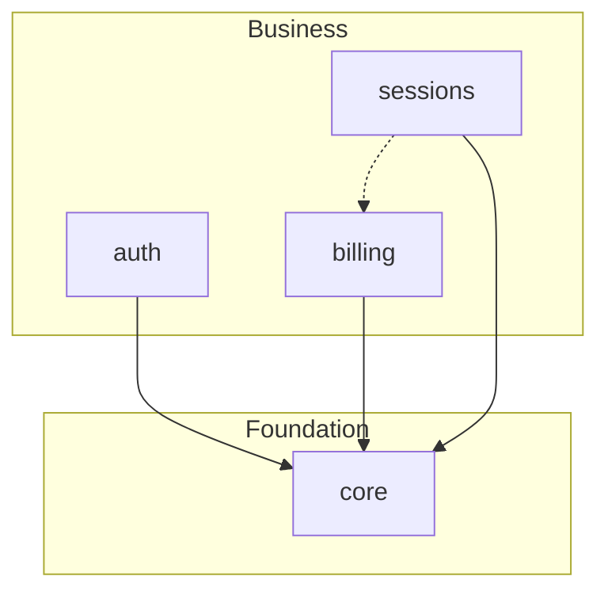

---
paths:
  - specs/_shared/**
  - specs/domains/*/_manifest.yaml
---

# Elementos Compartidos y Multi-Dominio KDD

> Aplica a `specs/_shared/` y manifests de dominio

## Estructura Multi-Dominio

```
specs/
├── _shared/                    # Elementos transversales
│   ├── policies/               # XP-* Políticas cross-domain
│   ├── glossary.md             # Términos globales
│   ├── domain-map.md           # Mapa de dominios
│   └── nfr/                    # NFRs globales
│
└── domains/                    # Bounded contexts
    ├── core/                   # Dominio fundacional
    │   ├── _manifest.yaml      # Metadatos del dominio
    │   ├── 01-domain/
    │   ├── 02-behavior/
    │   └── 03-experience/
    │
    ├── auth/
    ├── billing/
    └── sessions/
```

## Manifest de Dominio (`_manifest.yaml`)

### Ubicación

`specs/domains/{domain-name}/_manifest.yaml`

### Estructura Mínima

```yaml
domain:
  id: sessions                  # Debe coincidir con carpeta
  name: "Tareas TaskFlow"
  description: "Gestión de tareas de pensamiento"
  status: active                # active|deprecated|experimental|frozen
```

### Estructura Completa

```yaml
domain:
  id: sessions
  name: "Tareas TaskFlow"
  description: |
    Dominio principal. Gestiona el ciclo completo de tareas
    de pensamiento estructurado con miembros.
  status: active
  team: "@team-core"
  version: "1.0.0"
  tags: [core-business, taskflow]

dependencies:
  - domain: core
    type: required              # required|optional|event-only
    reason: "Usuarios y Proyectos son fundacionales"
    imports:
      entities: [Usuario, Proyecto]
      events: [EVT-Proyecto-Creado]

  - domain: billing
    type: optional
    reason: "Funciona sin puntos en modo demo"
    imports:
      events: [EVT-Credito-Consumido]

exports:
  entities: [Tarea, Sprint, Idea]
  events: [EVT-Tarea-Iniciada, EVT-Tarea-Completada]
  commands: [CMD-IniciarTarea]
  queries: [QRY-ObtenerTarea]

context-map:
  upstream: [core, billing]
  downstream: [analytics]

boundaries:
  anti-corruption:
    - external: "billing::Credito"
      internal: CreditoDisponible
      notes: "Solo nos interesa el balance"
```

### Campos del Manifest

| Sección | Campo | Requerido | Descripción |
|---------|-------|-----------|-------------|
| `domain` | `id` | Sí | Identificador (kebab-case) |
| `domain` | `name` | Sí | Nombre legible |
| `domain` | `description` | Sí | Propósito y alcance |
| `domain` | `status` | Sí | Estado del dominio |
| `dependencies` | `domain` | - | ID del dominio dependencia |
| `dependencies` | `type` | - | `required`, `optional`, `event-only` |
| `exports` | - | - | Artefactos públicos |

## Wiki-Links Cross-Domain

```markdown
# Mismo dominio (busca local → core)
[[Tarea]]

# Dominio explícito
[[core::Usuario]]
[[billing::Credito]]

# Elemento compartido
[[_shared::XP-AUDIT-001]]
```

## Políticas Compartidas (`_shared/policies/`)

### Nombrado

Patrón: `XP-NOMBRE-NNN.md` (Cross-Policy)

Ejemplos:
- `XP-LOGGING-001.md`
- `XP-AUDIT-001.md`
- `XP-SECURITY-001.md`

### Estructura

```markdown
---
id: XP-LOGGING-001
kind: cross-policy
title: Política de Logging
scope: all-domains
status: approved
---

# XP-LOGGING-001: Política de Logging

## Scope

Aplica a TODOS los dominios.

## Statement

Todo comando y query debe loguear entrada y salida con correlation ID.

## Requirements

1. Log level INFO para operaciones exitosas
2. Log level ERROR para fallos
3. Incluir `correlationId` en todos los logs
4. No loguear datos sensibles (passwords, tokens)

## Compliance

Verificado por: hook pre-commit, auditoría mensual
```

## Domain Map (`_shared/domain-map.md`)

```markdown
# Mapa de Dominios

## Diagrama



## Matriz de Dependencias

| Dominio | Depende de | Exporta a |
|---------|------------|-----------|
| core | - | auth, billing, sessions |
| auth | core | sessions |
| sessions | core, billing | analytics |
```

## Reglas de Dependencia

| Regla | Descripción |
|-------|-------------|
| Core fundacional | `core` no puede depender de ningún otro dominio |
| Explícitas | Toda dependencia en `_manifest.yaml` |
| Sin ciclos | A → B → A prohibido |
| Anti-corruption | Traducciones para conceptos externos |

## Niveles de Dominio

```
┌─────────────────────────────────────────────┐
│  LEAF (sin dependientes)                    │
│  sessions, analytics                        │
├─────────────────────────────────────────────┤
│  MIDDLE (bidireccional)                     │
│  auth, billing                              │
├─────────────────────────────────────────────┤
│  CORE (fundacional)                         │
│  core                                       │
└─────────────────────────────────────────────┘
```
