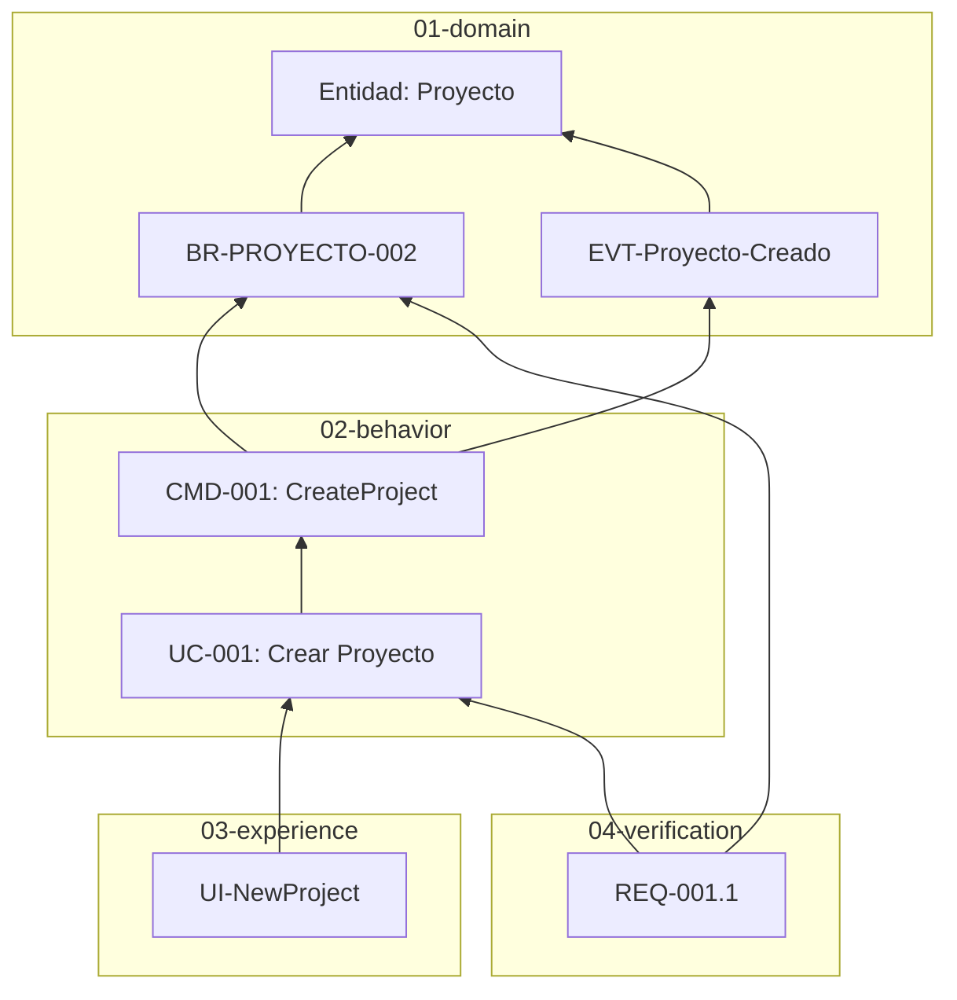

# KDD Trace

Construye y visualiza la matriz de trazabilidad entre capas KDD.

## Cuando Activarse

Activate cuando el usuario:
- Quiere entender como se conectan los artefactos
- Necesita verificar cobertura de requisitos
- Prepara auditoria o documentacion de release
- Pregunta "que depende de X?" o "X esta cubierto?"

## Estructura de Capas KDD

**IMPORTANTE**: Antes de analizar, verifica la estructura real del proyecto:

```
specs/
├── 00-requirements/     # PRD, objetivos, decisiones de alto nivel
│   ├── PRD.md
│   ├── objectives/
│   └── decisions/       # ADRs de requisitos
│
├── 01-domain/           # Modelo de dominio (NO referencia capas superiores)
│   ├── entities/        # Entidades del dominio
│   ├── rules/           # Reglas de negocio (BR-*, BP-*)
│   └── events/          # Eventos de dominio (EVT-*)
│
├── 02-behavior/         # Que puede hacer el sistema
│   ├── commands/        # Comandos (CMD-*)
│   ├── queries/         # Consultas (QRY-*)
│   ├── processes/       # Procesos orquestados (PROC-*)
│   ├── use-cases/       # Casos de uso (UC-*)
│   └── policies/        # Politicas transversales
│
├── 03-experience/       # Como interactua el usuario
│   ├── views/           # Vistas/pantallas (UI-*)
│   └── flows/           # Flujos multi-paso (FLOW-*)
│
├── 04-verification/     # Criterios de aceptacion
│   └── criteria/        # Requisitos verificables (REQ-*)
│
└── 05-architecture/     # Decisiones tecnicas
    ├── decisions/       # ADRs tecnicos
    └── implementation-charter.md
```

## Reglas de Dependencia entre Capas

**Las capas inferiores NO pueden referenciar capas superiores.**

```
00-requirements  <-------------------------------------------+
       | puede referenciar                                   |
01-domain        <--------------------------------------+    |
       | puede referenciar                              |    |
02-behavior      <---------------------------------+    |    |
       | puede referenciar                         |    |    |
03-experience    <----------------------------+    |    |    |
       | puede referenciar                    |    |    |    |
04-verification  -----------------------------+----+----+----+
       | puede referenciar
05-architecture  (puede referenciar todas)
```

### Direccionalidad de Referencias

| Capa Origen | Puede Referenciar | NO Puede Referenciar |
|-------------|-------------------|----------------------|
| `01-domain` | Solo dentro de 01-domain | 02, 03, 04, 05 |
| `02-behavior` | 01-domain, 02-behavior | 03, 04, 05 |
| `03-experience` | 01-domain, 02-behavior | 04, 05 |
| `04-verification` | 01, 02, 03 | 05 |
| `05-architecture` | Todas las capas | - |

### Trazabilidad Valida (direccion correcta)

```
Entidad (01) <- Regla (01) <- Comando (02) <- Use Case (02) <- Vista (03) <- Criterio (04)
    ^              ^              ^              ^              ^
    +----------------------------------------------------------+
                    Referencias hacia capas inferiores (valido)
```

### NO es Trazabilidad Valida

| Situacion | Por que es invalido |
|-----------|---------------------|
| Evento -> Comando | 01-domain no puede referenciar 02-behavior |
| Entidad -> Vista | 01-domain no puede referenciar 03-experience |
| Regla -> Criterio | 01-domain no puede referenciar 04-verification |

## Proceso

### Fase 1: Cargar Estructura Actual

**Antes de analizar**, verifica la estructura real:
```bash
ls specs/*/
```

No asumas estructura - las capas pueden haber cambiado.

### Fase 2: Escanear Artefactos

Lee todos los archivos en `specs/` y extrae:
- IDs de artefactos (UC-001, BR-PROYECTO-001, CMD-001, etc.)
- Wiki-links entre documentos `[[Entidad]]`
- Referencias en frontmatter (`links:`)

### Fase 3: Construir Grafo (respetando direccionalidad)

Genera la matriz de trazabilidad **siguiendo la direccion correcta**:

```markdown
## Matriz de Trazabilidad

### Desde Entidades (01-domain)

| Entidad | Reglas que la usan | Eventos que la afectan |
|---------|-------------------|------------------------|
| [[Proyecto]] | BR-PROYECTO-* (7) | EVT-Proyecto-* (5) |
| [[Tarea]] | BR-TAREA-* (6) | EVT-Tarea-* (8) |

### Desde Reglas hacia Capabilities (02)

| Regla | Comandos que la validan | Queries que la consultan |
|-------|-------------------------|--------------------------|
| BR-PROYECTO-002 | CMD-001, CMD-002 | - |
| BR-TAREA-001 | CMD-009 | QRY-003 |

### Desde Capabilities hacia Experience (03)

| Comando/UC | Vistas que lo invocan | Flows que lo usan |
|------------|----------------------|-------------------|
| CMD-001 | UI-NewProject | FLOW-CrearProyecto |
| UC-003 | UI-TaskView | - |

### Desde Todo hacia Verification (04)

| Artefacto | Criterios de Aceptacion |
|-----------|-------------------------|
| UC-001 | REQ-001.1 a REQ-001.7 |
| BR-PROYECTO-002 | REQ-001.4 |
```

### Fase 4: Analisis de Cobertura

```markdown
## Analisis de Cobertura

### Resumen
- Total artefactos: 108
- Con trazabilidad completa: 95 (88%)
- Parcialmente trazados: 10 (9%)
- Huerfanos: 3 (3%)

### Por Capa
| Capa | Total | Referenciados por capa superior | Cobertura |
|------|-------|--------------------------------|-----------|
| 01-domain/entities | 14 | 14 | 100% |
| 01-domain/rules | 43 | 40 | 93% |
| 01-domain/events | 20 | 18 | 90% |
| 02-behavior | 43 | 38 | 88% |
| 03-experience | 22 | 20 | 91% |

### Huerfanos (sin ser referenciados)

| Artefacto | Capa | Problema |
|-----------|------|----------|
| BR-LEGACY-001 | 01-domain | Ningun comando lo valida |
| UI-OldComponent | 03-experience | Ningun UC lo referencia |

**Nota**: Huerfanos en 01-domain son mas criticos (reglas no usadas).
```

### Fase 5: Visualizacion (opcional)

Si el usuario lo solicita, genera diagrama Mermaid **respetando direccionalidad**:



**Nota**: Las flechas van de capas superiores a inferiores (direccion de dependencia).

## Modos de Ejecucion

### Trazabilidad Completa
Genera matriz completa de todo el proyecto.

### Trazabilidad de Artefacto Especifico
Muestra:
- **Hacia abajo**: Que referencia este artefacto
- **Hacia arriba**: Que artefactos de capas superiores lo referencian

Ejemplo para `[[Proyecto]]`:
```markdown
## Trazabilidad: Proyecto

### Referencias de Proyecto (hacia abajo)
(Entidad no referencia nada - capa mas baja)

### Referenciado por (hacia arriba)
- 01-domain/rules: BR-PROYECTO-* (7 reglas)
- 01-domain/events: EVT-Proyecto-* (5 eventos)
- 02-behavior/commands: CMD-001 a CMD-004
- 02-behavior/use-cases: UC-001, UC-010
- 03-experience/views: UI-ProjectCard, UI-ProjectList, UI-ProjectEditor
- 04-verification/criteria: REQ-001, REQ-010
```

### Trazabilidad de Capa
Muestra conexiones de una capa hacia capas adyacentes.

## Uso en CI/CD

- **Release docs**: Generar matriz de trazabilidad para auditoria
- **PR check**: Verificar que nuevos artefactos tienen trazabilidad
- **Compliance**: Documentar cobertura de requisitos regulatorios

## Skills Relacionados

- `kdd-gaps` - Para detectar huecos especificos
- `kdd-review` - Para revisar calidad de artefactos
- `kdd-iterate` - Para completar cadenas incompletas

## Referencias

- Metodologia KDD: `kdd/kdd.md`
- Documentacion de capas: `kdd/docs/layers/`
