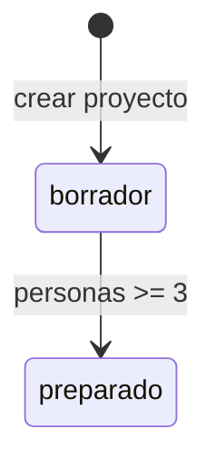

# Guía de Estilo para Documentación KDD

> Para: Todos los que escriben specs — Tipo: Referencia — Uso: Consulta puntual

Este documento define las reglas de escritura para toda especificación KDD. Cada regla incluye un ejemplo concreto del proyecto TaskFlow. Consulta la sección que necesites; no hace falta leer de corrido.

---

## Principios generales

Cuatro principios gobiernan toda escritura KDD. Aplícalos en cada oración.

### Audiencia primero

Cada documento declara su audiencia en el frontmatter o en la primera línea. El escritor asume que el lector conoce su rol pero no conoce KDD. El lector quiere resolver algo concreto. Escanea antes de leer. Las primeras líneas deciden si sigue.

Declara la audiencia así:

```markdown
> **Para**: Desarrolladores — **Tiempo**: 10 min — **Tipo**: How-to
```

### Una idea por oración

Cada oración transmite un solo concepto. Si una oración contiene "y" conectando dos ideas distintas, divídela en dos.

```markdown
# Mal
KDD organiza la documentación en capas que van desde los requisitos de negocio
hasta la verificación, pasando por el dominio y la experiencia de usuario,
cada una con sus propios artefactos y convenciones.

# Bien
KDD organiza la documentación en seis capas.
Cada capa responde una pregunta diferente sobre el sistema.
Las capas van desde "¿por qué existe?" hasta "¿cómo lo verificamos?".
```

### Voz activa

El sujeto realiza la acción. Usa voz activa en el 90% o más de las oraciones.

```markdown
# Mal (pasiva)
El artefacto es creado por el PM.
Los criterios son verificados durante el QA.

# Bien (activa)
El PM crea el artefacto.
QA verifica los criterios.
```

Excepción: usa voz pasiva cuando el actor es irrelevante o desconocido.

```markdown
El evento EVT-Proyecto-Creado se emite automáticamente.
```

### Verbos fuertes

Reemplaza construcciones débiles con verbos directos. Un verbo fuerte elimina palabras innecesarias.

| Débil | Fuerte |
|---|---|
| "hace la creación de" | "crea" |
| "lleva a cabo la verificación" | "verifica" |
| "es capaz de" | "puede" |
| "proporciona una descripción de" | "describe" |
| "en este momento" | "ahora" |
| "con el fin de" | "para" |
| "en el caso de que" | "si" |

```markdown
# Mal
El Sistema lleva a cabo la verificación del estado del Proyecto
con el fin de determinar si es capaz de aceptar nuevas Tareas.

# Bien
El Sistema verifica el estado del Proyecto para determinar si acepta nuevas Tareas.
```

---

## Terminología

### Define antes de usar

La primera vez que aparece un término KDD, defínelo en **negrita** con su sigla entre paréntesis. Las menciones siguientes usan la forma abreviada.

```markdown
# Bien
Un **Business Rule (BR)** define una restricción invariable del dominio.
Cada BR tiene un identificador único con formato `BR-ENTIDAD-NNN`.
El BR se documenta en `specs/01-domain/rules/`.

# Mal
Crea un Business Rule... La regla de negocio describe... El BR contiene...
```

### Consistencia absoluta

Usa el mismo término en todo el documento. No alternes entre sinónimos.

```markdown
# Mal
Crea un Use Case... El caso de uso describe... El UC contiene...

# Bien
Crea un **Use Case (UC)**... El UC describe... El UC contiene...
```

### Glosario de términos KDD

Los términos KDD se escriben siempre en inglés, con la misma forma exacta:

| Término | Forma correcta | Formas incorrectas |
|---|---|---|
| Use Case | Use Case (UC) | caso de uso, usecase, use-case |
| Business Rule | Business Rule (BR) | regla de negocio, BR rule |
| Command | Command (CMD) | comando, command |
| Objective | Objective (OBJ) | objetivo, OBJ |
| Query | Query (QRY) | consulta, query |
| Cross-Policy | Cross-Policy (XP) | política transversal |
| Value Unit | Value Unit (UV) | unidad de valor |

Después de la primera mención con definición, usa la forma abreviada de manera consistente.

---

## Estructura de documentos

### Frontmatter obligatorio

Cada documento empieza con un bloque YAML. El orden de campos es fijo:

```yaml
---
id: BR-PROYECTO-005              # Identificador primero
kind: business-rule           # Tipo de documento
status: draft                 # Estado del ciclo de vida
created: 2024-12-13           # Fecha de creación
tags:                         # Metadatos al final
  - proyecto
  - estado
---
```

Para documentos de `kdd/docs/`, el frontmatter incluye audiencia y tipo Diataxis:

```yaml
---
title: "Guía KDD para QA"
audience: [qa]
type: how-to
reading_time: "10 min"
status: draft
---
```

### Opening sentence

El primer párrafo responde: "¿Qué vas a aprender y por qué te importa?" Esta oración decide si el lector sigue o abandona.

```markdown
# Bien (spec real: BR-PROYECTO-005)
Un Proyecto transiciona a estado `terminado` cuando alcanza el límite fijo
de 4 tareas completadas, o cuando el Usuario lo cierra manualmente.

# Mal
En este documento se procede a describir las condiciones bajo las cuales
un Proyecto puede transicionar hacia el estado terminado.
```

### Párrafos

Cada párrafo tiene entre 3 y 5 oraciones. La primera oración es la más importante: funciona como resumen del párrafo. Un párrafo trata un solo tema. Si supera 5 oraciones, divídelo.

```markdown
# Bien (spec real: Proyecto.md)
Representa la pregunta, problema o desafío que se somete a análisis
mediante una Tarea del método de análisis. El Proyecto es el punto
de partida de toda dinámica. Define el foco de discusión para las
Miembros.
```

### Headers: máximo 3 niveles

Usa `#` para el título del documento (uno solo). Usa `##` para secciones principales. Usa `###` para subsecciones. No uses `####` ni niveles más profundos.

```markdown
# BR-PROYECTO-005: Transición a terminado     <!-- Título: # -->

## Declaración                              <!-- Sección: ## -->

## Cuándo aplica                            <!-- Sección: ## -->

### Casos Válidos                           <!-- Subsección: ### -->

### Casos Inválidos                         <!-- Subsección: ### -->
```

---

## Listas y tablas

### Listas numeradas vs viñetas

Usa **listas numeradas** cuando el orden importa (pasos, secuencias):

```markdown
1. Abre el Use Case relacionado.
2. Identifica el flujo principal.
3. Extrae cada paso como un caso de test.
```

Usa **listas con viñetas** cuando el orden no importa (opciones, características):

```markdown
- El UC describe el flujo usuario-sistema.
- El CMD define la operación atómica.
- La BR establece la restricción de negocio.
```

### Estructura paralela

Todos los ítems de una lista empiezan con la misma estructura gramatical. Si un ítem empieza con verbo en imperativo, todos empiezan con verbo en imperativo.

```markdown
# Mal
- Crear el archivo
- El frontmatter debe incluir...
- Validación de enlaces

# Bien
- Crea el archivo en la carpeta correcta.
- Completa el frontmatter con los campos requeridos.
- Valida que los enlaces funcionen.
```

### Cuándo usar tablas

Usa tablas cuando cada ítem tiene 2 o más atributos. Cada columna tiene un header descriptivo. Introduce cada tabla con una oración que termine en dos puntos.

```markdown
# Bien (spec real: CMD-003)
Los errores posibles del comando son:

| Código | Condición | Mensaje |
|---|---|---|
| PROYECTO-201 | No encontrado | "Proyecto not found" |
| PROYECTO-202 | No es propietario | "You don't have permission" |
| PROYECTO-203 | Tiene tareas | "Cannot delete with task history" |
```

```markdown
# Bien (spec real: Proyecto.md)
Los estados del ciclo de vida del Proyecto son:

| Estado | ID | Descripción |
|---|---|---|
| **Borrador** | `borrador` | Proyecto en configuración, aún no listo |
| **Preparado** | `preparado` | Proyecto completo con 3-6 Miembros |
| **En Análisis** | `en_analisis` | Al menos una Tarea iniciada |
| **Terminado** | `terminado` | Proyecto cerrado, inmutable |
```

---

## Código y ejemplos

### Bloques con lenguaje especificado

Cada bloque de código declara el lenguaje. Nunca uses bloques de código sin lenguaje.

````markdown
```typescript
const proyecto = await createProyecto(input)
```

```yaml
id: BR-PROYECTO-005
kind: business-rule
status: draft
```

```gherkin
Given a logged-in Usuario
When the Usuario creates a Proyecto
Then the Proyecto status should be "borrador"
```


````

### Ejemplos reales del proyecto

Usa datos reales del proyecto TaskFlow para los ejemplos. Nunca inventes datos genéricos.

```markdown
# Mal
Ejemplo: "Proyecto ABC necesita tomar una decisión."

# Bien
Ejemplo: "¿Deberíamos expandir nuestro producto al mercado europeo?"
```

Las entidades más usadas en ejemplos son: **Proyecto**, **Tarea**, **Miembro**, **Sprint** y **Etiqueta**.

### Entidades en bloques de código

En bloques de código, usa convenciones del lenguaje (camelCase/snake_case). La capitalización de dominio solo aplica en prosa.

```typescript
// En código: camelCase
const miembro = await createMiembro(input)
const tareaActiva = await getTareaActiva(proyectoId)
```

```markdown
<!-- En prosa: Capitalizado -->
El Miembro participa en la Tarea activa.
```

---

## Formato y énfasis

### Negrita para definiciones

Usa **negrita** la primera vez que defines un término. Usa **negrita** para nombres de artefactos en tablas de referencia.

```markdown
Un **Proyecto** representa la pregunta o desafío que se somete a análisis.
```

### Cursiva para énfasis

Usa *cursiva* para énfasis leve o títulos de documentos referenciados.

```markdown
El sistema *no permite* reabrir un Proyecto terminado.
Consulta la *Guía KDD para Desarrolladores* para más detalle.
```

### Código para paths, campos e IDs

Usa `código` para nombres de archivos, rutas, campos YAML, valores de atributos e identificadores.

```markdown
El campo `estado` acepta los valores `borrador`, `preparado`, `en_analisis` y `terminado`.
Consulta `specs/01-domain/entities/Proyecto.md` para la definición completa.
El identificador `BR-PROYECTO-005` regula la transición a terminado.
```

### Callouts

Usa blockquotes con prefijo para llamadas de atención:

```markdown
> **Tip**: Los links rotos son aceptables en estado `draft`.

> **Importante**: Cada BR debe tener la sección "Por qué existe".

> **Ejemplo**: Consulta `specs/01-domain/rules/BR-PROYECTO-005.md` para un modelo completo.
```

---

## Idioma

El proyecto usa una política bilingüe con reglas claras. El contenido narrativo se escribe en español. Los términos técnicos y de KDD se mantienen en inglés.

| Aspecto | Idioma | Ejemplo |
|---|---|---|
| Contenido narrativo | Español | "El PM crea un Objective." |
| Términos KDD | Inglés (primera mención + sigla) | "Un **Use Case (UC)**..." |
| Identificadores | Inglés, MAYÚSCULAS | `BR-PROYECTO-001`, `CMD-003`, `EVT-Proyecto-Creado` |
| Frontmatter keys | Inglés | `kind: business-rule`, `status: draft` |
| Código en ejemplos | Inglés | `function createProyecto()` |
| Nombres de archivos | Inglés | `BR-PROYECTO-005.md`, `CMD-003-DeleteProyecto.md` |

```markdown
# Bien
WHEN el Usuario ejecuta CMD-023-TerminarProyecto,
el Sistema SHALL transicionar el Proyecto a estado "terminado".

# Mal
CUANDO el Usuario ejecuta el comando para terminar proyecto,
el Sistema DEBE hacer la transición del Proyecto al estado "terminado".
```

---

## Convenciones KDD específicas

### Capitalización de entidades de dominio

Las entidades de dominio (Aggregates, Entities, Value Objects) siempre se escriben con la primera letra en mayúscula. Esto indica que el término es un concepto de dominio definido, no una palabra casual.

```markdown
# Bien
El Usuario crea un Proyecto y configura los Miembros.
Cada Tarea contiene múltiples Sprints.
La Etiqueta Azul controla el proceso.

# Mal
El usuario crea un proyecto y configura las miembros.
Cada sesión contiene múltiples sprints.
```

Excepciones a la capitalización:

- **Plurales**: mantienen la mayúscula ("los Proyectos", "las Tareas").
- **Artículos**: van en minúscula ("el Proyecto", "una Tarea").
- **Código/variables**: usan camelCase (`proyecto`, `tareaActiva`, `miembro`).

Los sistemas externos se escriben TODO EN MAYÚSCULAS: ORACLE, STRIPE, SAP.

### Wiki-links

Enlaza la primera mención de una entidad en cada sección. Las menciones siguientes no requieren enlace.

```markdown
[[Nombre de Entidad]]              # Link simple
[[Entidad|texto alternativo]]      # Link con alias
[[Tarea|tareas]]                # Plural
[[Miembro|participante]] # Sinónimo contextual
```

Reglas de enlazado:

| Situación | Acción |
|---|---|
| Primera mención en sección | Enlazar |
| Menciones posteriores | Opcional |
| En títulos/headers | NO enlazar |
| En bloques de código | NO enlazar |
| En tablas | Enlazar |

### Identificadores

Los identificadores siguen patrones fijos por tipo de artefacto. Siempre van en MAYÚSCULAS:

| Tipo | Patrón | Ejemplo |
|---|---|---|
| Use Case | `UC-NNN` | `UC-001` |
| Requirement | `REQ-NNN` o `REQ-NNN.M` | `REQ-001`, `REQ-001.2` |
| Event | `EVT-Entidad-Accion` | `EVT-Proyecto-Creado` |
| Business Rule | `BR-ENTIDAD-NNN` | `BR-PROYECTO-005` |
| Command | `CMD-NNN` | `CMD-003` |
| Process | `PRC-NNN` | `PRC-001` |
| ADR | `ADR-NNNN` | `ADR-0001` |
| Value Unit | `UV-NNN` | `UV-001` |

```markdown
# Bien
Este requisito deriva de [[UC-001-Crear-Proyecto]].
Aplica la regla [[BR-PROYECTO-005]].

# Mal
Este requisito deriva de uc-001.
Aplica la regla br-proyecto-005.
```

### Keywords EARS para requisitos

Las palabras clave EARS van siempre en **MAYÚSCULAS**. Estructuran los requisitos formales del sistema.

| Keyword | Propósito |
|---|---|
| `WHEN` | Evento disparador |
| `IF` | Condición (comportamiento no deseado) |
| `WHILE` | Estado continuo |
| `WHERE` | Característica opcional |
| `SHALL` | Obligación del sistema |
| `SHALL NOT` | Prohibición |

```markdown
# Bien (spec real: BR-PROYECTO-005)
WHEN a Proyecto completes its 4th Tarea,
the system SHALL transition the Proyecto to state "terminado"
  AND SHALL emit event "EVT-Proyecto-Terminado" with motivo "limite_sesiones"
  AND SHALL prevent any further state changes.
```

### Estados de entidades

Documenta los estados en una sección **Estados** separada, no inline en la tabla de Atributos. Usa **negrita** para el nombre visible y `código` para el ID técnico.

```markdown
# Bien
## Atributos
| `estado` | enum | Estado del ciclo de vida (ver [[#Estados]]) |

## Estados
| Estado | ID | Descripción |
|---|---|---|
| **Borrador** | `borrador` | Proyecto en configuración, aún no listo |
| **Preparado** | `preparado` | Proyecto completo con 3-6 Miembros |

# Mal
## Atributos
| `estado` | enum | Estado (`borrador`, `preparado`, `en_analisis`, `terminado`) |
```

---

## Checklist rápido

Revisa estos puntos antes de hacer PR con una spec:

**Estructura**
- [ ] Frontmatter completo (`id`, `kind`, `status`, campos requeridos)
- [ ] Primer párrafo responde "¿qué hace y por qué importa?"
- [ ] Máximo 3 niveles de headers (`#`, `##`, `###`)

**Estilo**
- [ ] Voz activa en el 90% o más de las oraciones
- [ ] Una idea por oración (sin "y" conectando ideas distintas)
- [ ] Verbos fuertes (sin "hace la creación de", "lleva a cabo")
- [ ] Párrafos de 3-5 oraciones

**Terminología**
- [ ] Términos KDD definidos en primera mención (**negrita** + sigla)
- [ ] Sin alternancia de sinónimos (siempre la misma forma)
- [ ] Entidades de dominio capitalizadas (Proyecto, Tarea, Miembro)

**Listas y tablas**
- [ ] Listas numeradas para pasos ordenados
- [ ] Listas con viñetas para ítems sin orden
- [ ] Estructura paralela en todos los ítems
- [ ] Tablas para datos con 2+ atributos por ítem

**Formato**
- [ ] **Negrita** para definiciones de primera vez
- [ ] `Código` para paths, IDs, campos YAML y valores
- [ ] Bloques de código con lenguaje especificado
- [ ] Ejemplos usan datos reales del proyecto (Proyecto, Tarea)

**Idioma**
- [ ] Narrativa en español
- [ ] Términos KDD en inglés (Use Case, Business Rule, Command)
- [ ] IDs en MAYÚSCULAS (`BR-PROYECTO-005`, `CMD-003`)
- [ ] Keywords EARS en MAYÚSCULAS (WHEN, SHALL, IF)

**KDD**
- [ ] Wiki-links en primera mención de cada entidad por sección
- [ ] Sin wiki-links en headers ni bloques de código
- [ ] Estados en sección separada, no inline en Atributos
- [ ] Identificadores con patrón correcto (`BR-ENTIDAD-NNN`, `UC-NNN`)
