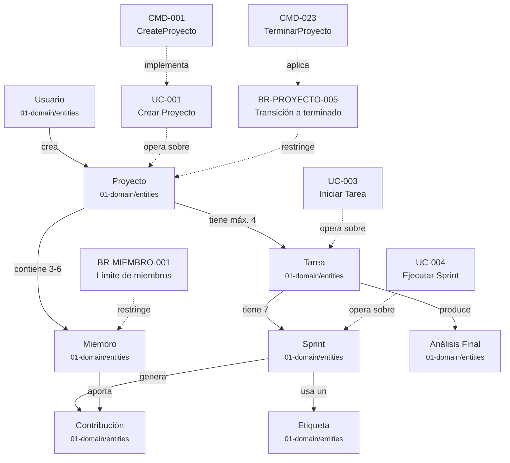

# El Grafo de Conocimiento

> **Para**: Todos los roles -- **Tiempo**: 8 min -- **Tipo**: Explanation

Este documento explica cómo las especificaciones KDD forman una red de conocimiento conectada. Descubrirás qué son los wiki-links, cómo crean relaciones bidireccionales entre documentos y cómo navegar este grafo con herramientas como Obsidian o VS Code.

---

## De documentos aislados a red de conocimiento

En la mayoría de proyectos, las especificaciones son documentos aislados. Un Use Case vive en una página, una Business Rule en otra y una entidad de dominio en otra. Para entender cómo se relacionan, el lector debe recordar de memoria dónde está cada cosa.

KDD resuelve este problema con **wiki-links**: enlaces entre documentos que crean una red navegable. Cada enlace es una conexión explícita entre dos conceptos. El conjunto de todas las conexiones forma un **grafo de conocimiento** donde las specs son nodos y los wiki-links son aristas.

Esta red permite navegar el conocimiento del proyecto de forma orgánica. Desde una entidad como Proyecto, puedes saltar a sus Business Rules, de ahí a los Use Cases que las aplican, y de ahí a los Commands que los implementan.

---

## Qué son los wiki-links

Un **wiki-link** es una referencia entre dos archivos Markdown escrita con doble corchete. KDD usa la convención de Obsidian para que los enlaces funcionen tanto en editores como en herramientas de visualización.

La sintaxis básica es la siguiente:

```markdown
[[Proyecto]]                              # Enlace simple a la entidad Proyecto
[[Tarea|tareas]]                   # Enlace con texto alternativo
[[BR-PROYECTO-005]]                       # Enlace a una Business Rule
[[CMD-001-CreateProyecto]]           # Enlace a un Command
[[UC-001-Crear-Proyecto]]                 # Enlace a un Use Case
```

El texto entre corchetes es el nombre del archivo destino (sin la extensión `.md`). Cuando se usa el formato `[[destino|texto]]`, el lector ve "texto" pero el enlace apunta a "destino".

### Ejemplo real: la entidad Proyecto

La spec `Proyecto.md` usa wiki-links para conectar con otras specs del proyecto:

```markdown
Representa la pregunta o desafío que se somete a análisis
mediante una [[Tarea]] del el método de análisis.
El Proyecto es el punto de partida de toda dinámica y define
el foco de discusión para las [[Miembro|Miembros]].
```

En este fragmento, tres wiki-links conectan la entidad Proyecto con la entidad Tarea, el concepto gestión ágil de proyectos y la entidad Miembro. Cada enlace es una arista en el grafo de conocimiento.

### Reglas de enlazado

KDD establece reglas claras sobre cuándo usar wiki-links:

| Situación | Acción |
|---|---|
| Primera mención de una entidad en una sección | Enlazar con `[[Entidad]]` |
| Menciones posteriores en la misma sección | Opcional, no obligatorio |
| Dentro de títulos o headers | No enlazar |
| Dentro de bloques de código | No enlazar |
| En tablas de referencia | Enlazar |

Estas reglas evitan la sobrecarga visual. Un documento con wiki-links en cada palabra se vuelve difícil de leer. Enlazar solo la primera mención por sección mantiene el balance entre navegabilidad y legibilidad.

---

## Cómo los wiki-links forman un grafo

Cada wiki-link crea una relación dirigida entre dos documentos. El documento que contiene el enlace es el origen; el documento al que apunta es el destino. Cuando múltiples documentos se enlazan entre sí, emerge una estructura de grafo.

### El grafo del proyecto TaskFlow

El siguiente diagrama muestra las relaciones reales entre las entidades principales del proyecto:



En este diagrama, las líneas sólidas representan relaciones de dominio ("un Proyecto contiene Miembros"). Las líneas punteadas representan relaciones de trazabilidad ("UC-001 opera sobre Proyecto", "CMD-023 aplica BR-PROYECTO-005").

### Tipos de relaciones

El grafo de KDD contiene dos tipos de relaciones:

- **Relaciones de dominio.** Conectan entidades entre sí. Un Proyecto contiene Tareas. Una Tarea tiene Sprints. Un Sprint usa un Etiqueta. Estas relaciones reflejan la estructura del negocio.
- **Relaciones de trazabilidad.** Conectan artefactos de distintas capas. Un Use Case referencia entidades y Business Rules. Un Command implementa un Use Case. Un Requirement verifica un Command. Estas relaciones permiten rastrear una decisión de negocio hasta su implementación y sus tests.

---

## Enlaces bidireccionales

Una característica del grafo de conocimiento es la **bidireccionalidad**. Cuando `Proyecto.md` enlaza a `[[Tarea]]`, herramientas como Obsidian detectan automáticamente que Tarea tiene un "backlink" desde Proyecto. Este enlace inverso no necesita escribirse manualmente: la herramienta lo infiere.

Los backlinks responden a preguntas como:

- "Qué specs mencionan a esta entidad?" Abre la entidad y mira sus backlinks.
- "Qué Use Cases usan esta Business Rule?" Abre la BR y mira sus backlinks.
- "Qué Commands implementan este Use Case?" Abre el UC y mira sus backlinks.

Esta capacidad convierte cada spec en un punto de entrada al grafo. No importa por dónde empieces a navegar: siempre puedes descubrir las conexiones hacia adelante (wiki-links) y hacia atrás (backlinks).

### Ejemplo concreto

La spec `BR-PROYECTO-005.md` contiene estos wiki-links:

```markdown
Un [[Proyecto]] transiciona a estado `terminado` cuando alcanza
el límite fijo de 4 tareas completadas, o cuando el Usuario
lo cierra manualmente via [[CMD-023-TerminarProyecto]].
```

Desde `BR-PROYECTO-005.md` puedes navegar hacia:
- `Proyecto.md` (la entidad que restringe)
- `CMD-023-TerminarProyecto.md` (el comando que la aplica)

Desde `Proyecto.md`, los backlinks muestran que `BR-PROYECTO-005` lo referencia. Desde `CMD-023-TerminarProyecto.md`, los backlinks muestran que `BR-PROYECTO-005` lo menciona. Toda la red es navegable en ambas direcciones.

---

## Cómo navegar el grafo

Existen dos herramientas principales para navegar el grafo de conocimiento KDD.

### Obsidian

Obsidian es un editor de Markdown que renderiza los wiki-links como enlaces clicables y ofrece una vista de grafo visual. Para usarlo con las specs de KDD:

1. Abre Obsidian y selecciona "Open folder as vault".
2. Selecciona la carpeta `specs/` del proyecto.
3. Navega entre specs haciendo clic en los wiki-links.
4. Abre la vista de grafo (`Ctrl+G`) para ver todas las conexiones.

La vista de grafo muestra los nodos (specs) y las aristas (wiki-links) como un mapa interactivo. Los nodos más conectados aparecen más grandes. Puedes filtrar por carpeta para ver solo las entidades de dominio, solo los Use Cases o solo las Business Rules.

El panel de backlinks (`Ctrl+Shift+B`) muestra todas las specs que enlazan al documento actual. Este panel es especialmente útil para responder preguntas de trazabilidad.

### VS Code

VS Code no renderiza wiki-links nativamente, pero extensiones como Markdown All in One y Foam añaden soporte. La navegación funciona así:

1. Coloca el cursor sobre un wiki-link como `[[Proyecto]]`.
2. Usa `Ctrl+Clic` para abrir el archivo enlazado.
3. Usa `Ctrl+Shift+F` y busca `[[BR-PROYECTO-005]]` para encontrar todos los backlinks manualmente.

VS Code es la opción preferida para desarrolladores que ya trabajan en el editor. No ofrece la vista de grafo visual de Obsidian, pero la navegación por enlaces y la búsqueda global cubren la mayoría de necesidades.

---

## El grafo como herramienta de calidad

El grafo de conocimiento no es solo un mapa de navegación. También funciona como herramienta de detección de problemas.

### Nodos huérfanos

Un nodo huérfano es una spec que nadie enlaza. Si una Business Rule no tiene backlinks desde ningún Use Case, puede significar que la regla no se aplica en ningún flujo. El validador de CI detecta estos casos y los reporta como advertencias.

### Enlaces rotos

Un enlace roto es un wiki-link que apunta a un archivo que no existe. Por ejemplo, `[[BR-PROYECTO-099]]` fallará si ese archivo no se ha creado. El pipeline de validación detecta enlaces rotos y bloquea el PR hasta que se corrijan.

### Densidad de conexiones

Un grafo saludable tiene alta densidad de conexiones. Si una entidad tiene pocas conexiones, puede indicar que la documentación está incompleta. Si un Use Case no enlaza a ningún Command, puede indicar que falta la implementación técnica de la spec.

> **Tip**: Abre la vista de grafo de Obsidian periódicamente. Los nodos aislados o poco conectados señalan las áreas del proyecto que necesitan más documentación.

---

## Lectura relacionada

- *Documentación como Código* (`concepts/docs-as-code.md`): el flujo Git, PRs y CI que mantiene el grafo consistente.
- *Trazabilidad* (`concepts/traceability.md`): cómo las conexiones del grafo permiten rastrear de requisito a test.
- *Convenciones de Nombrado* (`reference/naming.md`): los patrones de IDs que hacen los wiki-links predecibles.
