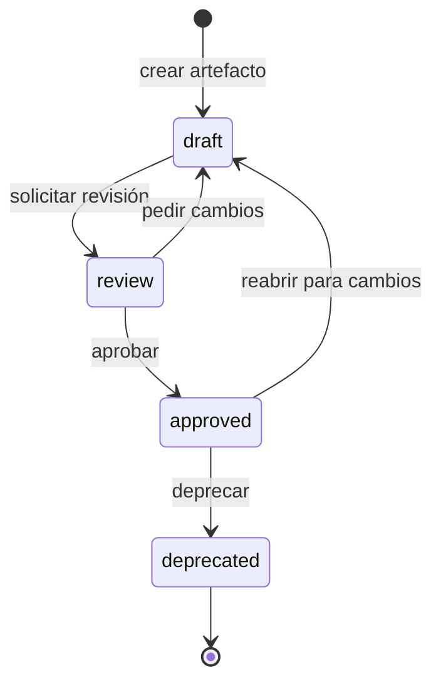

# Ciclo de vida de status

> **Para**: Todos los roles -- **Tiempo**: 5 min -- **Tipo**: Referencia

Cada artefacto KDD tiene un campo `status` en su frontmatter que indica su nivel de madurez. Este documento describe los cuatro estados posibles, las transiciones entre ellos y las reglas que gobiernan cada cambio. Consúltalo cuando necesites saber si una spec es fuente de verdad o si puedes modificarla.

---

## Diagrama del ciclo

El ciclo de vida sigue una progresión lineal de cuatro estados. Un artefacto nace como borrador y avanza hasta ser aprobado o, eventualmente, deprecado.



> **Tip**: La transición de `approved` a `draft` solo ocurre cuando un artefacto aprobado necesita cambios significativos. Cambios menores (typos, formato) no requieren reabrir el ciclo.

---

## Los cuatro estados

Cada estado tiene un significado preciso. No uses `proposed` ni otros valores personalizados; el ciclo completo tiene exactamente cuatro estados.

| Estado | Valor en frontmatter | Significado |
|---|---|---|
| **Borrador** | `draft` | Trabajo en progreso. No es fuente de verdad. Puede contener enlaces rotos o secciones incompletas. |
| **En revisión** | `review` | Pendiente de aprobación. El contenido se considera completo pero necesita validación. |
| **Aprobado** | `approved` | Fuente de verdad oficial. El equipo puede implementar, diseñar y testear a partir de este artefacto. |
| **Deprecado** | `deprecated` | Obsoleto. Debe enlazar al artefacto que lo reemplaza. |

### Borrador (`draft`)

Un artefacto en `draft` indica que el autor todavía trabaja en su contenido. Cualquier rol puede crear artefactos en este estado. Los enlaces rotos y las secciones vacías son aceptables durante esta fase.

Ejemplo de frontmatter en estado `draft`:

```yaml
---
id: BR-USUARIO-004
kind: business-rule
entity: Usuario
status: draft
created: "2024-12-21"
---
```

### En revisión (`review`)

Un artefacto en `review` tiene contenido completo y espera aprobación. El autor solicita la revisión al Tech Lead o al rol responsable. Durante esta fase, el revisor puede solicitar cambios, lo que devuelve el artefacto a `draft`.

El artefacto en `review` cumple estos requisitos:

- Todas las secciones requeridas por su tipo (`kind`) están completas.
- Los enlaces internos (wiki-links) resuelven a artefactos existentes.
- El frontmatter sigue el schema del tipo correspondiente.
- Los ejemplos usan datos reales del proyecto.

### Aprobado (`approved`)

Un artefacto en `approved` es la fuente de verdad oficial del proyecto. El equipo basa sus decisiones de implementación, diseño y testing en este documento. Si hay conflicto entre la spec aprobada y el código, la spec gana.

Ejemplo real del proyecto:

```yaml
---
id: ADR-0001
kind: adr
status: approved
date: "2024-12-13"
---
```

### Deprecado (`deprecated`)

Un artefacto en `deprecated` ya no es válido. El frontmatter debe incluir metadatos adicionales que indiquen el motivo, la fecha y el artefacto que lo reemplaza.

Ejemplo real del proyecto:

```yaml
---
kind: ui-view
status: deprecated
deprecated:
  date: 2026-02-07
  reason: "Funcionalidad absorbida por la sección Proyecto del hub unificado"
  superseded-by: VIEW-Proyecto
---
```

El cuerpo del artefacto deprecado debe incluir un bloque de aviso al inicio:

```markdown
> **DEPRECATED**: Esta vista ha sido absorbida por [[VIEW-Proyecto]].
```

---

## Transiciones

Cada transición entre estados tiene un disparador, un responsable y condiciones que deben cumplirse.

### Tabla de transiciones

| Transición | Disparador | Responsable | Condiciones |
|---|---|---|---|
| `draft` a `review` | El autor considera que el artefacto está completo | Autor (cualquier rol) | Secciones requeridas completas, frontmatter válido, enlaces resueltos |
| `review` a `draft` | El revisor solicita cambios | Tech Lead o revisor asignado | Feedback documentado en el PR o en comentarios |
| `review` a `approved` | El revisor acepta el artefacto | Tech Lead | Checklist de revisión aprobado, sin comentarios pendientes |
| `approved` a `draft` | El artefacto necesita cambios significativos | Tech Lead | Justificación documentada, comunicación al equipo |
| `approved` a `deprecated` | El artefacto ya no aplica o fue reemplazado | Tech Lead | Artefacto de reemplazo identificado, metadatos `deprecated` completos |

### Reglas de transición

Cinco reglas gobiernan las transiciones. Respeta cada una al cambiar el status de un artefacto.

1. **Solo hacia adelante por defecto.** La progresión normal es `draft` a `review` a `approved`. Las transiciones hacia atrás (`review` a `draft`, `approved` a `draft`) son excepciones justificadas.
2. **Nunca saltar estados.** Un artefacto no pasa de `draft` directamente a `approved`. Siempre pasa por `review`.
3. **Deprecado es terminal.** Un artefacto en `deprecated` no vuelve a ningún estado anterior. Si el contenido vuelve a ser relevante, crea un artefacto nuevo.
4. **Aprobación requiere Tech Lead.** Solo el Tech Lead (o un rol con autoridad equivalente) puede mover un artefacto a `approved`.
5. **Cambiar status es un commit.** Cada cambio de status se registra en un commit dedicado o como parte de un PR revisado.

---

## Quién puede cambiar status

No todos los roles tienen los mismos permisos para mover artefactos entre estados. La siguiente tabla muestra las acciones permitidas por rol.

| Acción | PM | Diseñador | Dev | QA | Tech Lead |
|---|---|---|---|---|---|
| Crear artefacto (`draft`) | Sí | Sí | Sí | Sí | Sí |
| Solicitar revisión (`draft` a `review`) | Sí | Sí | Sí | Sí | Sí |
| Pedir cambios (`review` a `draft`) | No | No | No | No | Sí |
| Aprobar (`review` a `approved`) | No | No | No | No | Sí |
| Reabrir (`approved` a `draft`) | No | No | No | No | Sí |
| Deprecar (`approved` a `deprecated`) | No | No | No | No | Sí |

> **Importante**: En equipos pequeños donde no hay un Tech Lead asignado, el rol de aprobación recae en quien el equipo designe. Lo esencial es que exista *una persona* responsable de mantener la calidad de las specs aprobadas.

---

## Cuándo cambiar status

Usa esta tabla como guía rápida para decidir el momento correcto de cada transición.

| Situación | Transición recomendada |
|---|---|
| Acabas de crear un artefacto nuevo | Mantener en `draft` |
| Completaste todas las secciones requeridas y el frontmatter es válido | Mover a `review` |
| El Tech Lead revisó y encontró problemas | Devolver a `draft` |
| El Tech Lead revisó y el artefacto cumple el checklist | Mover a `approved` |
| La implementación reveló que la spec necesita cambios mayores | Reabrir: mover a `draft`, aplicar cambios, repetir el ciclo |
| Una nueva spec reemplaza a esta | Mover a `deprecated` con metadatos completos |
| Corriges un typo o formato en una spec aprobada | Mantener en `approved` (no requiere reabrir el ciclo) |

---

## Frontmatter por status

El campo `status` es obligatorio en todos los artefactos KDD. Su valor determina qué campos adicionales son necesarios.

### Campos requeridos por status

| Status | Campo `status` | Campos adicionales requeridos |
|---|---|---|
| `draft` | `status: draft` | Ninguno adicional |
| `review` | `status: review` | Ninguno adicional |
| `approved` | `status: approved` | Ninguno adicional |
| `deprecated` | `status: deprecated` | `deprecated.date`, `deprecated.reason`, `deprecated.superseded-by` |

### Ejemplo completo de artefacto deprecado

```yaml
---
id: UI-ProyectoEditor
kind: ui-view
status: deprecated
deprecated:
  date: 2026-02-07
  reason: "Funcionalidad absorbida por la sección Proyecto del hub unificado"
  superseded-by: VIEW-Proyecto
---
```

---

## Validación

El comando `bun run validate:specs` verifica que el campo `status` contenga un valor válido. Las reglas de validación son:

- El valor debe ser uno de: `draft`, `review`, `approved`, `deprecated`.
- Si el status es `deprecated`, los campos `deprecated.date`, `deprecated.reason` y `deprecated.superseded-by` deben existir.
- No se acepta el valor `proposed` ni ningún otro valor personalizado.

---

## Consulta rápida

```
draft ──────► review ──────► approved ──────► deprecated
  ▲              │                │
  └──────────────┘                │
  (pedir cambios)                 │
  ▲                               │
  └───────────────────────────────┘
       (reabrir para cambios)
```

| Pregunta | Respuesta |
|---|---|
| ¿Puedo implementar a partir de una spec en `draft`? | No. Solo las specs en `approved` son fuente de verdad. |
| ¿Quién aprueba una spec? | El Tech Lead o la persona designada por el equipo. |
| ¿Puedo editar una spec en `approved`? | Sí, para cambios menores (typos, formato). Para cambios significativos, reabre el ciclo moviendo a `draft`. |
| ¿Qué hago si una spec aprobada ya no aplica? | Muévela a `deprecated` con los metadatos requeridos. |
| ¿Puedo crear artefactos directamente en `approved`? | No. Todo artefacto nace en `draft` y pasa por `review`. |
